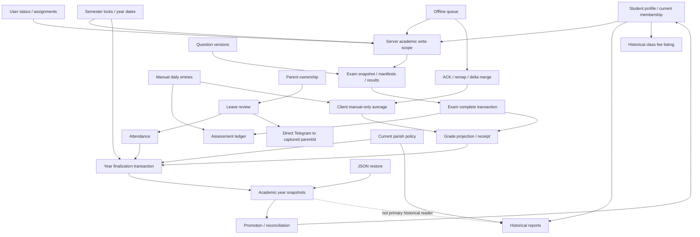

# Cross-Domain Integration & Invariant Audit — Catevia / TNTTVN

Ngày: 2026-09-07. Baseline audit ở §1–§8 là read-only đối với product code và dữ liệu ứng dụng. §0 ghi riêng remediation được người dùng cho phép sau audit. Đây không phải bản xác nhận đủ điều kiện release.

## 0. Remediation — working tree, chưa deployed

Baseline bên dưới giữ nguyên để tra lại evidence tại `6603bae`; không dùng các mô tả lỗi lịch sử làm kết luận cho working tree đã sửa.

- **XD-04 — regression verified:** Attendance và leave approval kiểm tra lock ngay trong write transaction bằng ngày thực tế: mọi persisted year range chứa ngày đó, trạng thái khóa/finalized/promoted/archived và cả canonical/legacy semester-lock namespace. API tạo năm học từ chối range vượt cửa sổ Aug–July của ID; vẫn cho phép thời gian giảng dạy ngắn hơn. Không sửa/migrate range legacy tự động. Evidence: `isAttendanceDateLocked` → `AttendanceApplicationService.markAttendance` / leave review; [crossDomainPeriodLocks.test.ts](../server/src/__tests__/crossDomainPeriodLocks.test.ts), **7/7 PASS**, gồm single/batch/leave, legacy ID và tenant/date controls.
- **XD-05 — regression verified:** Leave review dùng resolver recipient hiện tại chung với notification queue, giới hạn trong original parent IDs còn ACTIVE và còn sở hữu học sinh chưa xóa. Telegram chỉ chứa generic academic-update message, không còn tên/ngày/reviewer/note. [leaveRequests.test.ts](../server/src/__tests__/leaveRequests.test.ts) kiểm current/relinked/locked/deleted parent và deleted student. Đây vẫn là best-effort delivery sau commit, không phải durable outbox hay guarantee ownership không đổi trong khoảng network send.
- **XD-08 — regression verified:** Add/delete daily ledger project Grade trong cùng transaction, tính toàn bộ persisted attempts (manual + exam + legacy baseline), giữ manual override. `gradeService.upsertGrade` tự tính lại `daily_avg`, kể cả legacy clear, không tin partial average từ client; không có ledger thì từ chối non-null derived score. Undo Grade-only không được revert daily projection. Client pull không còn ghi đè điểm server bằng local partial ledger và manual-entry UI không enqueue thêm Grade writer. Evidence: [dailyEntries.test.ts](../server/src/__tests__/dailyEntries.test.ts), [dailyGradeStore.test.ts](../src/__tests__/stores/dailyGradeStore.test.ts), rollback add/delete, duplicate/version, override và undo controls. Đây là prevention cho writes mới; chưa reconcile điểm/ledger lịch sử hoặc chứng nhận mọi trạng thái offline preview.
- **XD-09 — CONTAINED, không đóng full recovery:** Partial JSON restore trả `409 RESTORE_PROTECTED_ACADEMIC_STATE` nếu có snapshot/năm học protected và `409 RESTORE_UNSUPPORTED_DEPENDENCIES` nếu có ledger, exam receipts, leave/fee/import/service provenance hoặc outbox chưa dispatch nằm ngoài JSON profile. Guard chạy trước safety backup và lặp lại trong restore transaction trước delete. Success audit và client-data generation commit cùng restore. Client chặn restore khi own queue chưa settled, rồi reset/logout theo generation; thiết bị khác hoặc legacy chưa có marker reset trước khi replay queue cũ. [crossDomainRestore.test.ts](../server/src/__tests__/crossDomainRestore.test.ts) cùng purge/sync/UI regressions chứng minh failure không delete, không tăng generation và không cài uploaded rows vào client. Chưa bổ sung semantic export cho các dependency này hoặc sửa DB đã mất snapshot. Protected/excluded state vẫn cần full-database recovery.
- **Trạng thái mới nhất:** toàn bộ remediation/containment local của XD-01…XD-09 và follow-up R0/U3 ở §0.1–§0.5 đã qua full serialized coverage **331/331 files, 2,360/2,360 tests** cùng lint/inventory/DS/build. Production recovery/key/R2, production reconciliation inventory, corrective backfill approval và device/browser qualification vẫn mở; baseline phía dưới không được coi là current defect status.

XD-01 follow-up trace trước sửa: `getPromotionReconciliation` và `listAcademicYears` đều dùng ACTIVE/LATEST-record existence; `retryPromotion` lấy worklist từ reconciliation và archive dùng lại gate đó. `/promotion/approve` chủ đích snapshot-only theo route contract. Implementation mới và giới hạn legacy nằm ở §0.1.

### Verification remediation

- Targeted Grade/override/audit/exam suite: **4 files / 55 tests PASS**. Attendance/leave/lifecycle/lock suite: **7 existing files / 49 tests PASS**, cùng 7 period-lock regressions ở trên. Các test daily-entry, leave, client store, notification authority, restore integrity và Grade undo cũng đã chạy; không cộng các lượt trùng thành coverage mới.
- Security-critical gate: **7 files / 73 tests PASS**.
- Diagnostic file sau đợt đầu: **11/11 PASS**, 12.62s; XD-04/05/08/09 là regressions. Trạng thái mixed suite sau đợt tiếp theo ghi ở §0.1; không diễn giải 11 PASS là tất cả finding đã đóng.
- Lint, architecture inventory, design-system guard, client/server TypeScript và frontend/PWA/backend production builds PASS.
- Full serialized `npm run test:coverage -- --fileParallelism=false`: **323 files PASS / 1 file FAIL; 2,278 tests PASS / 1 FAIL**, tổng 324 files / 2,279 tests, 977.71s. Failure duy nhất là metadata test thiếu ledger mô tả dưới đây. Lượt full trả exit 1 và không tạo coverage summary; **chưa xác nhận coverage thresholds hoặc full CI xanh**. Không rerun 323 file đã PASS sau thay đổi chỉ ở test bị fail; browser E2E và production chưa chạy.
- Các lần targeted đầu có lỗi fixture (thiếu required student fields, baseline ledger dùng chung, pending leave cleanup, rate-limit test isolation) và type annotations; đã sửa fixture/type, chạy lại các file fail và PASS. Không bỏ test hay giảm invariant để lấy kết quả xanh.
- Full run phát hiện test metadata cũ gửi `daily_avg` không có ledger (`gradeLifecycleVerification.test.ts`). Test đã bổ sung assertion thiếu ledger → 409 và không tạo Grade; sau khi tạo ledger thì client average sai phải bị server tính lại, vẫn giữ assertions metadata. Rerun **7/7 PASS**, 6.78s; root TypeScript PASS sau cập nhật. Không coi rerun này là một full run mới.
- Đợt đầu không migration/backfill; đợt tiếp theo thêm migration code và chỉ chạy trên DB test như §0.1. Không chạy trên dữ liệu production, gửi Telegram thật, commit, push hoặc deploy. SSOT đã đồng bộ: Business Rules, API Contract, Architecture và Security Audit Log.

### 0.1 Follow-up — XD-01 và XD-07 (2026-09-07, working tree)

**XD-01 — regression verified, legacy reconciliation chưa deployed:** thêm nullable `promotion_records.completed_at` và `completed_target_year_id` (migration 177/178). `BatchPromotionApplicationService` ghi receipt sau membership move cùng transaction; year wizard cũng ghi qua `DrizzlePromotionRepository.markCompleted`. Shared `promotionCompletionPredicate` dùng ở list và reconciliation, gián tiếp bảo vệ retry/archive. Receipt gắn đúng target persisted; approval-only không đủ, thiếu mapping là unresolved/error, receipt write failure rollback cả move/snapshot. Receipt không bị tính lại từ class pointer về sau. No-destination batch vẫn là approval-only; writer có guard terminal no-move, không biến mọi approval không có destination thành complete.

- Regression: single approval → wizard vẫn phải xử lý item; same record được completion sau move; receipt wrong target bị list/archive từ chối; later class correction không xóa historical receipt; lỗi sau receipt write rollback toàn item và retry chỉ item đó. Existing partial-success/OCC/authorization semantics giữ nguyên.
- Recovery/migration: **không tự backfill** record cũ từ current class hay ACTIVE flag. `auditPromotionReconciliation.ts` kiểm columns và receipt predicate mới, chỉ read-only khi operator chạy trên target đã chọn. Legacy ARCHIVED thiếu receipt cần review; không tự unarchive, chuyển lớp hoặc chứng nhận lại lịch sử. Chưa chạy inventory hay migration trên DB thật. Rollback phải giữ columns/evidence; quay về writer cũ sẽ tái mở defect.

**XD-07 — regression verified cho local ACK/remap fault:** queue row giữ `serverAcknowledgement` mã hóa, owner-scoped; không cần thêm Dexie table/index. `acknowledgeCreatedParent` persist ACK → apply/remap → retire; `processClaimedOperation` replay durable ACK trước network. Nếu lỗi persist thì parent còn và retry giữ original idempotency key; nếu lỗi remap/retire thì chu kỳ dừng trước child batch và retry không gửi CREATE lần hai. Remap class/student không phụ thuộc temp row còn ở Zustand; remap pending/retrying/failed dependents, giữ trạng thái permanent failure. Parse/storage errors không bị catch-and-skip; ACK rows bị loại khỏi enqueue dedup, compaction và pruning.

- Tests real encrypted fake-IndexedDB + coordinator/API mocks kiểm: remap failure, mất ephemeral roster, ACK ciphertext, child-send blocked, no second CREATE khi replay ACK, same idempotency key trước ACK persistence, retire failure và corrupt ACK fail-closed. Probe audit flip thành positive regression.
- Giới hạn: không cứu tự động parent ACK đã bị xóa trước patch; chưa physical browser-kill/quota hay mọi concurrent-enqueue/owner-switch interleaving. Corrupt dependent payload có thể chặn remap và cần Diagnostics; không xóa để giả lập success. Explicit user-discard/reset vẫn là recovery decision riêng.

Verification đợt này: promotion/lifecycle/migration **5 files / 37 tests PASS**; sync store/tenant/remediation suite đầu **4 files PASS**, một fixture status trong file mới sai đã sửa; rerun + retry/isolation/processor/network + promotion routes/concurrency **7 files / 79 tests PASS**; ACK fault/migration-runner suite **3 files / 28 tests PASS**. Mixed diagnostic **11/11 PASS**, 21.26s: XD-01/04/05/07/08/09 là regression/containment controls; XD-02/03/06 vẫn tái hiện lỗi. Không cộng các lượt trùng thành coverage mới.

Final checks: lint/inventory, server build và frontend/PWA build (gồm TypeScript) PASS. Security-critical run **71 PASS / 2 timeout**, 6/7 files PASS; hai timeout auth-cookie 5s xảy ra khi build đang chạy. Sau build, rerun nguyên timeout cùng lifecycle wrong-target regression: **2 files / 22 tests PASS**, 29.01s (auth-cookie 7/7, lifecycle 15/15). Chưa chứng minh nguyên nhân timeout chỉ là contention; không nới timeout/giảm test. Chưa rerun full coverage sau migration/ACK patch; không kế thừa full-run cũ thành full CI xanh. Worktree có thêm thay đổi đồng thời ở README/router/layout ngoài phạm vi; giữ nguyên, không tính là remediation do đợt này thực hiện.

### 0.2 Follow-up — XD-02 và XD-03 (2026-09-07, working tree)

**XD-02 — prevention regression verified, legacy recovery còn mở.** `AcademicYearLifecycleService.finalizeYear` ghi `academic_years.finalization_policy` cùng transaction với year lock và student snapshots: concrete weights/rounding, attendance/promotion policy, classification thresholds, date range và original class labels. Mỗi snapshot thêm `source_class_id` và versioned `report_snapshot` chứa effective semester scores (đã áp overrides) + attendance summary. Không copy tên/điện thoại/profile cá nhân vào payload học vụ.

Call paths sau sửa: `ReportingApplicationService.createProjectionContext` → `getFinalizedYearContext` (validate persisted JSON/version; no current-policy fallback) → ReportCard/ClassSummary projection đọc snapshot; `PromotionApplicationService.evaluateStudentWithData/approvePromotion` → frozen metrics/policy khi year finalized. Evaluate read cũng dùng một transaction cho auth/metrics/policy/specification. Client GPA/rate mismatch vẫn bị reject; manual decision khác auto vẫn cần reason; current authorization/ownership vẫn authoritative. Open year tiếp tục đọc live settings.

**XD-03 — regression verified cho cohort/report/fee facts mới.** Historical class summary dùng source cohort, không dùng `students.classId`; report giữ original class label sau promotion/rename. Student được đưa vào lớp sau finalize không tự trở thành historical cohort. Class fee listing đọc trong transaction, union persisted original class/year/type facts với current open-year roster hoặc evidenced finalized cohort; không mất paid row chỉ vì học sinh chuyển lớp, không dùng cohort năm này để tạo unpaid row năm khác. Đây là read-model change, không mở quyền sửa historical fee. Current profile/soft-delete visibility vẫn áp dụng: xóa mềm có thể giảm visible report roster theo policy riêng, không phải phục hồi quyền cũ.

**Migration/recovery gate:** migrations `20260907-179..181` chỉ thêm nullable columns, không backfill. Finalized year thiếu/invalid policy hoặc snapshot thiếu cohort/report evidence trả conflict trên affected historical path, không lấy settings/class hiện tại để dựng lịch sử. Report routes giữ contract 409 `REPORT_GENERATION_ERROR`; promotion wizard ghi item error và giữ unresolved. Legacy fee facts vẫn đọc được; không có cohort evidence thì không sinh thêm synthetic unpaid rows. Các dòng synthetic vốn là UI placeholder, không phải proof of debt. Chưa inventory/reconcile DB thật, chạy migration production hoặc chứng nhận legacy history. Rollback giữ evidence columns; quay về old readers tái mở defect.

**Verification:** suite ban đầu **4 files PASS**, file history mới **7/8 PASS** do fixture dùng sai tên cột override; đã sửa fixture. Lượt tiếp **6 files / 33 tests PASS** (history, migration integrity/runner, fee lifecycle, reporting authorization/error mapping). Promotion/batch/retry/concurrency/routes **5 files / 24 tests PASS**. History suite cuối mở rộng cohort mới, same IDs across parishes, wrong-year fee control: **9/9 PASS**, 6.88s. Mixed diagnostic cuối **11/11 PASS**, 10.64s: XD-02/XD-03 đã flip thành positive regression; XD-06 vẫn là defect probe. Một lượt probe giữa chặng còn assert retry success sau worklist đã hết; đã sửa thành đúng contract 409/no remaining work, trong khi retry sau injected failure được kiểm riêng bởi history regression. Không bỏ invariant để có PASS, không cộng các lượt trùng thành coverage mới.

Final static verification: server build, root TypeScript, lint, architecture inventory và `git diff --check` PASS sau implementation. Không chạy full coverage/CI, browser E2E hoặc production trong đợt này. Các thay đổi landing/router/E2E đồng thời ngoài phạm vi được giữ nguyên.

### 0.3 Follow-up — XD-06 và recovery XD-09 (2026-09-07, working tree)

**XD-06 — reconnect-time cache retraction regression verified.** `GET /grades|attendance?includeScope=true` → `runDbTransaction` → `getAcademicReadStudentIds` kiểm lại current role/status/epoch và assignments → complete scope + scoped records trên cùng executor. Revision hash chứa parish/user/sorted student IDs/semester; thay đổi scope buộc full snapshot, không bỏ sót unchanged rows vừa được cấp quyền nằm trước delta cursor. Empty scope trả records rỗng. Original array endpoints giữ nguyên contract.

Client `gradeStore/attendanceStore.fetch*` → `api.pull*` → `mergeAcademicPull` validate envelope/scope/revision, bỏ read projection ngoài scope kể cả local pending, giữ own pending projection trong scope. Durable encrypted queue không bị xóa để “dọn cache”. Generation + tenant-scope object chặn response cũ và same-ID logout/login; `academicCacheStorage` serialize writes theo captured storage key và pull await persistence trước khi thành công. Persistence v2 bỏ replaceable v1 cache không có scope evidence, giữ queue nguyên vẹn. Lỗi quota/malformed response không được coi là successful pull để advance cursor.

Evidence: `server/src/__tests__/academicScopePull.test.ts` (revoke/grant, semester change, deleted student, same IDs across parishes); `src/__tests__/academicScopeCache.test.ts` (durable retraction, pending queue unchanged, delayed response, session replacement, malformed envelope, quota fault/retry, v1 hydration). Final targeted **5 files / 84 tests PASS**, 21.36s, gồm hai suite trên, sync-engine, sync-engine-flow và schemaHealth. Earlier Grade store/purge/flow/server-scope run **4 files / 40 tests PASS**; không cộng lượt trùng thành coverage mới.

Giới hạn: chỉ chứng minh Grade/Attendance read cache khi client reconnect và nhận scope mới; không remote-erase máy offline, exports/screenshots hay chứng nhận mọi cache domain khác. Queued intent ngoài scope được giữ để xử lý/reject server-authoritatively. Scope revision không phải universal tombstone cho mọi record bị xóa trong scope không đổi; physical crash/cross-tab/device qualification chưa chạy.

**XD-09 — local full-schema recovery verified, production recovery chưa đóng.** Standalone `scripts/backup-db.mjs` trước đó vẫn fallback raw main-file copy khi VACUUM lỗi. Đã thay bằng unique `.partial` → VACUUM → rename; không publish/prune khi snapshot/publish thất bại, checkpoint failure chỉ warning. Fault regressions ở `src/__tests__/backupCli.test.ts` **3/3 PASS** (filesystem/libSQL mocks, không backup DB thật).

`restoreLogicalSnapshot` từ chối duplicate table/column declarations và snapshot thiếu bảng của target trước writes; sau restore đối chiếu encoded row multisets ngoài counts/FKs, phát hiện trigger thay đổi nội dung dù count bằng nhau. Mismatch sau commit yêu cầu discard target, không cutover. Existing full-target preflight/fingerprint/production URL guards không bị nới. `prepareRemoteRestoreTarget` dùng `prepareEmptyRestoreTarget` với bootstrap/migrations thật: chỉ target chưa có application table, kiểm đúng **4** default-fund seeds migration 120 vừa tạo rồi xóa riêng seeds trong transaction. Unexpected application data fail closed. Đây sửa blocker thực tế “prepare tạo funds nhưng restore đòi target trống”, không phải generic clear-target operation.

Startup/restore readiness yêu cầu markers 177–181 và columns policy/cohort/report/completion. `crossDomainHistory.test.ts` chạy finalize → promote → archive → read-transaction full snapshot → AES-GCM roundtrip → real current-schema preparation → restore/readiness → exact critical-table equality, frozen policy và receipt giữ nguyên. History **10/10 PASS**, 16.18s tổng file; remoteBackup **7/7 PASS**, gồm thiếu bảng, equal-count content corruption và FK/non-empty controls. SchemaHealth gồm negative controls từng evidence column và migration marker trong lượt 84 tests ở trên. Không dùng partial JSON để vượt protection guard.

Các lượt phát triển ban đầu có fixture shared-memory isolation và Windows `EBUSY` khi unlink SQLite transaction handle, sau đó timeout 5s của test thực hiện cả bootstrap/181 migrations/restore. Đã dùng per-test OS-temp file (không cố xóa khi native handle còn sống); full drill có timeout riêng 30s, không đổi timeout/invariant toàn suite. Các assertions restore được giữ nguyên và rerun PASS; temp fixture chỉ chứa dữ liệu synthetic. Backup/cache fault suite trước đó **4 files / 28 tests PASS**. Không cộng overlapping runs thành tổng duy nhất.

**Final regression probe:** **11/11 PASS**, 10.47s; cả chín XD đã chuyển sang regression hoặc containment controls. Đây không đồng nghĩa chín risk production đã đóng: XD-09 partial JSON vẫn bị chặn và recovery chỉ được drill local; legacy reconciliation vẫn cần nguồn evidence đáng tin cậy.

Security-critical gate sau XD-06/09: **7 files / 73 tests PASS**, 20.36s, không chạy đồng thời với build.

Frontend/PWA production build (`npm run build:frontend`, gồm root TypeScript) PASS sau regression. Build vẫn có warnings cấu hình `.env NODE_ENV` và deprecated `inlineDynamicImports`; không coi đây là kiểm chứng runtime/device hoặc benchmark.

Rollout/recovery order: kiểm inventory và backup/recovery evidence trước, deploy backend/schema tương thích trước client scope-aware; backend giữ array contract cho client cũ. Client mới không chấp nhận array cũ như full-scope evidence. Giữ evidence columns khi rollback; quay về old client/readers sẽ tái mở cache/history defects. Không xóa queue hoặc tự dựng missing history để vượt các gates.

**Release/operations vẫn mở:** chưa chạy migration/inventory trên DB production, chưa chứng minh R2 artifact + key recovery + isolated Turso drill + login/critical workflow smoke trên exact release. Không tự backfill lịch sử từ current settings/roster hoặc tự sửa năm đã chốt. Root TypeScript và server build PASS; architecture inventory, DS anti-drift và diff check PASS. Global lint còn 2 `react(only-export-components)` warnings trong concurrent landing work (`LandingStatsStrip.tsx`, `LandingFAQ.tsx`) ngoài scope, được giữ nguyên. Full coverage và browser E2E follow-up được ghi riêng ở §0.4; không suy chúng thành production qualification. Không commit/push/deploy.

### 0.4 Local release verification follow-up (2026-09-07, working tree)

Added `e2e/cross-domain-scope.spec.ts` to the critical portfolio. Chromium with real Vite/Hono/SQLite and real encrypted IndexedDB passed **1/1**, 23.5s including harness (12.4s test), on isolated loopback ports 3210/3211. It proves Grade/Attendance caches contain granted data, remain while disconnected, retract after server assignment revocation + reconnect, stay empty after reload, and do not delete authoritative history. No mocked HTTP or direct store mutation. Harness removed its owned synthetic database afterward; no production data was touched.

Initial E2E setup failures: historical attendance date was in a locked period (403), then creation asserted 200 instead of actual 201. Fixed the test's open-period fixture and expected status; did not weaken application lock policy. Original staff assignments are restored in `finally`.

The earlier full coverage process was lost across environment replacement; it had reported two landing-test failures but no final summary. It remains **INCOMPLETE**, not PASS.

A fresh serialized coverage run completed in 1,051.36s: **327/329 files passed; 2 failed; 2,336/2,339 tests passed; 3 failed**. It returned exit 1 before a trustworthy coverage-threshold conclusion, so full CI/coverage is **not green**. The failures were investigated rather than suppressed:

- `authAuditCacheRemediation.test.ts` still expected Grade cache schema v1 after XD-06 intentionally migrated it to v2. The assertion now verifies v2 plus the null scope revision.
- Two `backup.test.ts` restores reused the global `gia-ton` fixture. Rows created by unrelated suites in non-exported dependent tables made the partial restore's student delete fail on a foreign key. The restore itself rolled back; this was fixture contamination, not evidence that a partial snapshot could safely overwrite those dependencies. Each whole-parish restore test now owns a unique parish fixture.
- Added a positive containment regression: when an unprotected parish has a non-exported manual assessment ledger, fee record, import/service/exam provenance, leave request or undispatched outbox, partial JSON restore returns typed **409 `RESTORE_UNSUPPORTED_DEPENDENCIES` before the safety write**. It preserves current data and does not advance generation. Same IDs in another parish do not block this tenant. Supported recovery for such a state remains the full-schema procedure, not widening the partial restore's destructive contract or relying on an incidental FK failure.

Targeted rerun of the three affected files passed **3/3 files, 15/15 tests** in 15.81s. This closes the three observed suite failures at their changed surface, but the other 327 files were not rerun merely to relabel the failed full run. Existing landing lint warnings remain outside cross-domain remediation scope.

An alternate post-restore client path was also corrected. `BackupRestoreModal` previously treated the uploaded command payload as committed truth, pushed rows directly into Zustand, and wrote raw legacy-shaped values into `db.stores`; this bypassed server tenant rewriting/normalization and the XD-06 scope-aware encrypted Grade/Attendance envelope. It now blocks before POST if the current owner has any `pending|processing|retrying|failed` mutation. After server ACK it requires the returned generation, clears Dexie/local state through `resetClientData`, and logs out; it never hydrates or full-pulls from the uploaded file/session. Other devices probe generation before sync; a legacy device with no marker but an unsettled own queue resets instead of baselining. Server generation + success audit are in the restore transaction, so rollback cannot publish a false generation and audit failure cannot produce a committed restore followed by HTTP 500. If device reset fails after commit, the UI says restore already committed and does not invite a destructive retry. Dependency closure was widened after tracing every explicitly deleted or silently retained parent reference: staff assignment, attendance session and notification rows can be cascaded; manual financial transactions and import mapping memory can be silently rebound; grade-import receipts can contradict restored Grade state; legacy 2.0 cannot carry current exam-question snapshots. Each now causes a typed pre-mutation 409. Backup/restore security regressions passed **10 files / 70 tests**; current focused restore/generation/UI/sync regressions passed **5 files / 41 tests**, and the expanded dependency regression passed **11/11**. This closes the code-supported stale-queue replay and known excluded-parent loss paths, but browser crash/cross-tab/device-storage failure and production recovery quiescence remain operational qualification gaps.

Final checks for this follow-up: security-critical **7 files / 73 tests PASS**; import/finance **4 files / 32 tests PASS**; server and frontend/PWA production builds PASS; targeted oxlint, design-system guard **0/133**, architecture inventory **31 routes / 6 repositories / 52 services / 12 domain modules / 57 tables**, and diff check PASS. Global lint still returns exit 1 only for the two pre-existing concurrent landing Fast Refresh warnings at `LandingFAQ.tsx:10` and `LandingStatsStrip.tsx:11`; remediation files have zero warnings. The earlier failed full coverage invocation was not relabelled or rerun, so full CI/coverage remains unconfirmed. No production DB, R2/Turso target, commit, push or deploy was touched.

### 0.5 R0 reconciliation và import-parent ownership follow-up (2026-09-07, working tree)

`audit:cross-domain-reconciliation` là inventory read-only cho hai corrective-write gate còn mở: (1) năm `FINALIZED|PROMOTED|ARCHIVED` thiếu frozen policy, snapshot hoặc source-class/report evidence; (2) Grade daily-derived lệch/mất full assessment ledger. Active manual override được loại trừ. Script yêu cầu schema evidence hiện hành trước khi mở read transaction, output mặc định chỉ có hashed parish/aggregate refs, reason và ledger entry count; không in student/Grade ID hay giá trị điểm, không backfill/sửa row. Synthetic in-memory regressions kiểm missing evidence, mismatch, manual override exclusion và privacy output.

U3 được thu hẹp thêm bằng current evidence. Import undo nay chặn khi row sẽ xóa/đổi parent-phone link và một tài khoản `phuhuynh` cùng parish đã được tạo từ số đó sau import, hoặc current linked account có audit `UPDATE_USER_PHONE` sau import. Update không đổi parent phone không bị chặn giả. Guard dùng current phone link + timestamp/audit đã tồn tại, không suy historical phone bị redact và không thêm relation table. Regression tạo parent account sau import chứng minh student được giữ. Targeted reconciliation/import suite cuối **2 files / 19 tests PASS**, gồm schema-preflight fail-closed; server typecheck và targeted lint PASS. Production inventory và mọi corrective write vẫn chưa chạy.

Full CI follow-up đầu tiên qua lint/inventory/DS/build nhưng coverage phát hiện một commit-time `SQLITE_BUSY` ở Grade override smoke: **329/330 files, 2,352/2,353 tests PASS**, exit 1. Cùng file PASS 10/10 khi chạy thường và PASS 10/10 dưới coverage cô lập (coverage command đơn lẻ chỉ exit 1 vì global threshold không thể đạt từ một file). Trace xác nhận `GradeApplicationService.overrideScore/restoreScore` còn dùng direct transaction, khác transaction boundary chuẩn của write services. Hai command nay dùng bounded `runDbTransaction`; callback chỉ mutate DB/local return và notification vẫn sau committed wrapper, nên retry không phát side effect ngoài transaction. Full rerun sau thay đổi được ghi ở verification mới nhất, không relabel lượt đỏ này.

Verification mới nhất sau transaction fix và các probe stabilization: targeted Grade/reconciliation/import **4 files / 34 tests PASS**; notification queue regression **1 file / 18 tests PASS**. Probe queue nay tìm đúng failed-item ID thay vì giả định phần tử mới luôn ở index 0 của lịch sử singleton; production queue semantics không đổi. Một full serialized coverage invocation cuối đã xanh **331/331 files, 2,360/2,360 tests**, 856.34s; coverage **71.21% statements / 60.60% branches / 64.17% functions / 73.84% lines**. Current lint PASS không warning; architecture inventory **31/6/52/12/57**; DS anti-drift **0/134**; root TypeScript + server/frontend/PWA production build PASS (**2,822 modules**, **251 precache entries**); diff check PASS (chỉ có cảnh báo line-ending LF→CRLF của working tree). Đây là local engineering evidence trên working-tree snapshot, không thay thế production migration/inventory, R2/Turso recovery drill, browser/device qualification hoặc corrective-write approval.

## 1. Snapshot, phương pháp và kết luận

- Snapshot đã kiểm tra: `main`, HEAD `6603bae0efbe526b64edc8f0ad3280c078265fa3`.
- Worktree ban đầu có `docs/assessment-question-bank-exam-omr-audit-2026-09-06-r1.md` untracked; giữ nguyên, không coi tài liệu đó là implementation evidence.
- Chỉ thêm báo cáo, ma trận và diagnostic probes trong `scripts/audits/`. Không sửa runtime, schema, business rule; không chạy trên DB thật, không gửi Telegram thật, không commit/push.
- D3: đã đọc Decision Matrix theo AGENTS.md. File hiện tại tại `.gemini/skills/decision-matrix/SKILL.md` thực tế là tài liệu Quantitative Targets & SLOs; áp dụng yêu cầu evidence/critical invariant, không tự dựng SLA hay error budget. Không coi thiếu workflow trong file đó là product defect.
- Reconstruct từ route → service → transaction/repository → persisted fact → client queue/read model và tests. Audit cũ chỉ cung cấp giả thuyết tìm kiếm; kết luận bên dưới dựa current source và probe mới.

**Kết luận:** transaction boundaries bên trong từng command đã được củng cố đáng kể, nhưng hệ thống chưa giữ được toàn bộ invariant khi ghép các command hợp lệ theo thời gian. Có **9 finding cross-domain được tái hiện**, tập trung vào authority của dữ liệu lịch sử, completion receipt, scope retraction, identity remap và recovery semantic. Không cần rewrite hay tách microservice để xử lý chúng.

Ưu tiên theo consequence của yêu cầu audit:

- **P0:** XD-05 — gửi review của leave tới parent đã mất ownership; XD-08 — ledger và Grade tự động tính hai kết quả khác nhau sau Exam.
- **P1:** XD-01 — reconcile coi snapshot-only approval là hoàn tất chuyển lớp; XD-02 — policy mới đổi report cũ và làm promotion retry không hội tụ; XD-03 — promotion làm lệch historical cohort/report/fee listing; XD-04 — academic-year date range và lock namespace không thống nhất; XD-07 — ACK/remap fault để dependent mutation mắc ở ID tạm; XD-09 — JSON restore phá trạng thái FINALIZED/snapshot.
- **P2:** XD-06 — server đã thu hồi scope nhưng delta merge vẫn giữ academic cache cũ. Chưa chứng minh đường UI đọc mới trái phép; không gọi đây là bypass backend.

Mức ưu tiên không biểu thị tần suất production. Sự cố trên dữ liệu giáo xứ thật, thiết bị thật và production storage chưa được kiểm tra.

### Verification thực sự đã chạy

Diagnostic suite: [probe](../scripts/audits/cross-domain-invariants-2026-09-07.probe.ts), [config](../scripts/audits/cross-domain-invariants-2026-09-07.vitest.config.ts).

- Run đầu: 6/6 cases PASS, 9.79s.
- Run bổ sung XD-03/XD-06/XD-07: 3 PASS, 5 deselected, 10.68s; XD-03 mở rộng thêm finance listing.
- Run XD-04 public-date-range/XD-08/XD-09: 3 PASS, 8 deselected, 12.88s.
- Tổng cộng **11 case độc lập đã chạy thành công qua các lượt**, gồm 9 finding, một biến thể legacy của XD-04 và một positive lock control. Không tuyên bố đã chạy một lượt toàn bộ bản probe cuối.
- Existing suite: 9 files / 72 tests PASS, 29.45s: academicYearLifecycle, ReportingProjection, leaveRequests, academicNotificationAuthority, dailyEntries, examLifecycleAudit, BatchPromotionRetrySafety, import-data-integrity-audit-d, sync-engine-flow.
- Existing importDeduplicationHardening: 1 file / 14 tests PASS, 6.03s. Tổng existing verification: **10 files / 86 tests**.
- Chưa chạy full CI, coverage, browser E2E hoặc device/production benchmark trong audit này. Existing E2E được đọc để đánh giá coverage, không tính là đã rerun.

**PASS của diagnostic probe nghĩa là assert đã tái hiện hành vi hiện tại, không phải lỗi đã được sửa.** Config bỏ cloud DB credentials; global setup dùng SQLite trong OS-temp `parish-test-*`; client dùng fake IndexedDB. Telegram sender được mock. Probe restore còn mock safety-snapshot storage để không ghi local/R2 backup thật; nó chứng minh DB transition sau một safety-write thành công giả lập, không chứng minh chất lượng recovery storage.

Lệnh tái lập:

```sh
npm run test -- --config scripts/audits/cross-domain-invariants-2026-09-07.vitest.config.ts --reporter=verbose
```

## 2. Invariant graph và authority thực tế



Graph biểu diễn observed dependencies, không khẳng định mọi cạnh là defect. Các ma trận owner/producer/consumer/recovery và writer chi tiết ở [tài liệu ma trận](cross-domain-invariant-matrices-2026-09-07.md).

### Những boundary đã đúng nhưng không đủ để suy ra toàn hệ thống đúng

1. **Một transaction nhất quán tại thời điểm đọc không đồng nghĩa lịch sử bất biến.** Finalize và Reporting đều dùng transaction executor đúng, nhưng một report chạy ngày hôm sau vẫn đọc policy/membership mới — XD-02/03.
2. **Receipt của một bước không đồng nghĩa receipt của cả workflow.** `/promotion/approve` có chủ đích chỉ lưu snapshot; reconciliation lại diễn giải nó như item chuyển lớp đã xong — XD-01.
3. **Server không trả dữ liệu ngoài scope không tự xóa bản đã cached.** Assignment hiện tại bảo vệ HTTP writes/reads; delta merge không có retraction — XD-06.
4. **Chờ remap xong không đủ nếu lỗi remap bị nuốt và ACK đã bị xóa.** Promise resolve không phải durable convergence — XD-07.
5. **Atomic restore đúng một tập bảng không chứng minh toàn business aggregate được khôi phục.** Count/checksum chỉ kiểm subset được khai báo — XD-09.

## 3. Verified Cross-Domain Strengths

### S1 — Scope được kiểm lại ở server khi thực hiện command

`AttendanceApplicationService.markAttendance` → transaction → current academic write access + semester lock; `gradeService.upsertGrade` cũng kiểm current access/lock cùng transaction. Probe thu hồi assignment xác nhận cùng token không thể ghi attendance sau revoke; `GET /grades` trả `[]` khi scope rỗng. Không còn dùng hidden navigation hay payload classId làm authority duy nhất. Evidence: [attendance service](../server/src/services/AttendanceApplicationService.ts#L49), [grade service](../server/src/services/gradeService.ts#L120), [assignment update](../server/src/services/userService.ts#L440).

Giới hạn: strength này không phủ semantic của academic-year date namespace (XD-04) hoặc dữ liệu đã cached (XD-06).

### S2 — Exam complete vẫn là server writer, receipt và ledger/Grade cùng transaction

`POST /exams/:id/complete` → `finalizeExamSession`: current actor/class check, lock, persisted results, assessment ledger, protected manual/override conflict items, Grade write với external tx, receipt và completed state cùng transaction. Completed replay trả receipt cũ. Client `completeAndFinalize` project receipt, không tự ghi Grade cho chính complete flow. Evidence: [exam service](../server/src/services/examService.ts#L1058), [client complete](../src/stores/examStore.ts#L485); existing examLifecycleAudit + dailyEntries PASS.

Đây là xác nhận remediation hiện tại, không lặp lại finding dual-writer cũ của Exam complete. XD-08 là **sequence khác**: manual daily workflow diễn ra sau complete và thay đổi cùng derived Grade.

### S3 — Question materialization cắt phụ thuộc vào mutable question content

`buildExamFromBank` đọc version/rule và materialize session, answer variants/manifest, `examQuestionSnapshots` có `questionVersionId/contentHash` trong transaction. Result/scoring đọc session snapshot, không đi ngược lại current question để chấm bài đã phát hành. Evidence: [buildExamFromBank](../server/src/services/questionBankService.ts#L481), [snapshot writes](../server/src/services/questionBankService.ts#L593). Đây là code-supported strength; audit này không chạy lại corpus OMR/variant qualification.

### S4 — Finalize nguồn học vụ đã nằm trong cùng transaction

`finalizeYear` đọc locks, grades/overrides, attendance, policies và evaluate bằng transaction executor rồi ghi snapshots + `FINALIZED`. Test D1 trong [academicYearLifecycle.test.ts](../server/src/__tests__/services/academicYearLifecycle.test.ts#L162) PASS; probe canonical year kiểm lock chặn cả direct attendance lẫn leave approve. Không report lại lỗi split-read/global-executor của audit architecture cũ.

### S5 — Promotion atomic per student, partial batch có chủ đích

Snapshot + membership/branch move cùng `runDbTransaction` cho mỗi item; failure một item không rollback cả parish batch theo ADR-008. Counters được ghi sau callback thành công, retry callback không tự nhân đôi response item. Evidence: [year promotion](../server/src/services/AcademicYearLifecycleService.ts#L847), [retry safety test](../server/src/__tests__/services/BatchPromotionRetrySafety.test.ts#L7), [business rule](BUSINESS_RULES.md#L77). Reconciliation tồn tại thật; vấn đề là predicate của nó chưa đúng cho alternate approval path (XD-01).

### S6 — Leave review và attendance có CAS/transaction

Review re-read current child/current teacher scope, kiểm PENDING và semester lock; đổi request status, ghi `AbsentExcused` và audit cùng transaction. Competing reviewers không cùng thắng. Existing leaveRequests PASS; canonical locked-year probe từ chối approve và không tạo attendance. Evidence: [review transaction](../server/src/routes/leaveRequests.ts#L280). Telegram sau commit là boundary riêng, không được hưởng tính đúng này — XD-05.

### S7 — Import không còn “HTTP thành công là mọi dòng đều thành công”

Duplicate decision thiếu → skip fail-closed; class mapping/year validation; per-row provenance/counters; undo có snapshot chính xác, time window, current-row check, downstream activity blockers và itemized results. Recovery dựng lại batch state từ committed provenance, discover stale scopes ở composition root. Evidence: [import recovery](../server/src/services/importService.ts#L228), [downstream guards/undo](../server/src/services/importService.ts#L1876), [tests](../server/src/__tests__/services/importDeduplicationHardening.test.ts#L340). 14 test hardening PASS. Không suy ra mọi loại downstream relationship đều được guard; xem U3.

### S8 — Child-academic queued notifications đã re-resolve current recipients

`notificationQueue.currentChildRecipients` lấy current child phone, giao original targets với ACTIVE current parent owners, rồi mới delivery. Evidence: [recipient resolver](../server/src/services/notificationQueue.ts#L37); academicNotificationAuthority PASS. Strength có scope cụ thể: grade/absence academic queue, không phải toàn bộ notification entry paths.

## 4. Verified Cross-Domain Defects

### XD-01 — P1 — Snapshot-only approval được coi như promotion item đã hoàn tất

**Domains/category:** Promotion decision → Academic-year orchestration → Student membership. Recovery/Reconciliation + Atomicity/Convergence.

**Path:** `POST /api/promotion/approve` → `PromotionApplicationService.approvePromotion` → ACTIVE/LATEST `promotion_records`; sau đó `promoteYear` → `getPromotionReconciliation` → skip student đã có record → `archiveYear`.

**Trigger tái hiện:** finalize năm có một học sinh → single approve hợp lệ, có `nextClassId` → promote năm → archive. Probe XD-01: `attempted=0`, `unresolvedCount=0`, archive thành công nhưng `students.classId` vẫn là lớp cũ.

**Authority/boundary:** single approval sở hữu decision snapshot; batch/year orchestration sở hữu move. Mỗi transaction cục bộ đúng, nhưng join reconciliation chỉ hỏi “có ACTIVE/LATEST record không”, không hỏi workflow effect nào đã commit. Evidence: [snapshot-only contract](../server/src/routes/promotion.ts#L47), [single writer](../server/src/services/PromotionApplicationService.ts#L199), [reconciliation predicate](../server/src/services/AcademicYearLifecycleService.ts#L626), [skip resolved IDs](../server/src/services/AcademicYearLifecycleService.ts#L766), [archive gate](../server/src/services/AcademicYearLifecycleService.ts#L908).

**Impact:** UI/admin có thể hoàn tất năm khi học sinh chưa thực hiện effect đã định. Retry cũng skip vì record vẫn hiện hữu. Không phải lỗi fallback “chưa tạo lớp tiếp theo”: probe có destination hợp lệ, không có warning được chủ ý chấp nhận.

**Coverage:** lifecycle happy path tạo record và move qua cùng orchestrator; không thử single-approve trước yearly promotion. Probe mới bao phủ tổ hợp này.

**Hướng fix:** completion receipt cần phân biệt decision-only với applied membership effect/no-move decision hợp lệ; reconciliation dựa receipt/outcome gắn source year, destination và snapshot identity. Không chỉ đổi tên endpoint hoặc kiểm current class bằng suy đoán sau này.

### XD-02 — P1 — Current policy đổi lịch sử report và làm promotion retry không hội tụ

**Domains/category:** Parish settings → Finalization snapshot → Promotion verification → Reporting. Competing authority + Historical/projection inconsistency.

**Path:** finalize → `academic_year_snapshots.yearGpa` → `PUT /api/settings` đổi weights → report context lấy current weights; yearly promotion gửi old snapshot GPA → `computeAuthoritativeMetrics` tính lại bằng current weights → DATA_MISMATCH.

**Reproduced:** oral=10, final=6: snapshot GPA=7; đổi oral/final weights thành 3/1 → historical report GPA=9. Promotion lỗi; retry vẫn lỗi, unresolved=1; snapshot vẫn 7. Không có race hay client giả mạo.

**Authority/boundary:** snapshot và current settings đều được coi là authority cho cùng finalized fact. Transaction isolation chỉ thống nhất dữ liệu trong mỗi request, không pin policy version theo năm. Evidence: [finalize snapshot](../server/src/services/AcademicYearLifecycleService.ts#L548), [settings write](../server/src/routes/settings.ts#L190), [current metrics](../server/src/services/PromotionApplicationService.ts#L92), [comparison](../server/src/services/PromotionApplicationService.ts#L326), [report context](../server/src/services/ReportingApplicationService.ts#L25).

**Impact:** report cũ không còn diễn giải cùng lịch sử với snapshot; hướng dẫn “đồng bộ lại và thử lại” không chữa được mismatch vì dữ liệu nguồn snapshot bất biến. Normative historical-policy requirement: [BUSINESS_RULES](BUSINESS_RULES.md#L51).

**Coverage:** ReportingProjection test chứng minh chung transaction; lifecycle tests dùng policy không đổi giữa finalize và promotion. Cả hai xanh nhưng không bao phủ đổi policy sau finalize.

**Hướng fix:** pin policy identity/inputs tại snapshot; finalized reports và promotion consumption dùng snapshot/policy đó. Current policy chỉ áp dụng phạm vi hiệu lực được duyệt. Trước migration cần recon old snapshots thiếu policy provenance; không sửa GPA cũ bằng policy hiện tại.

### XD-03 — P1 — Current membership thay thế historical cohort trong report và fee listing

**Domains/category:** Promotion/Student membership → Reporting/Finance. Identity & relationship drift + Historical inconsistency.

**Path:** promote đổi `students.classId` → historical `GET /api/reports/class-summary/:oldClassId` và report-card join current class; `GET /api/finances/classes/:classId/fees` → `listClassFeeRecords` lấy current class students trước, rồi map records của old year.

**Reproduced:** promotion thành công, moved=1; old-year class summary `totalStudents:1→0`; report-card cùng old year đổi class name từ lớp 1 sang lớp 2. Fee PAID gắn old class/year: listing `1→0`, trong DB vẫn đúng một fee record.

**Authority/boundary:** membership là current mutable pointer; historical query dùng nó như enrollment-at-year. Không có transaction nào giữ lại cohort identity chỉ bằng việc atomically move. Evidence: [report current class join](../server/src/repositories/ReportCardProjectionRepository.ts#L71), [class-summary current roster](../server/src/repositories/ClassSummaryProjectionRepository.ts#L53), [fee current roster/map](../server/src/services/financeService.ts#L293), [fee endpoint](../server/src/routes/finances.ts#L208).

**Impact:** báo cáo lớp/năm cũ mất học sinh, nhãn lớp phiếu điểm sai thời điểm; sổ thu theo lớp/năm không hiển thị khoản đã nộp sau promotion. **Không chứng minh tiền/grade row bị xóa**, cũng không khẳng định mọi financial report đều sai.

**Coverage:** existing projection fixture không chuyển lớp sau ghi học vụ; fee lifecycle riêng không chứng minh historical membership transition. Probe mới đi qua promotion thật và kiểm cả DB preservation.

**Hướng fix:** historical cohort/class-at-assessment hoặc enrollment-at-year phải có authority bền vững. Fee listing bắt đầu từ persisted fee records cho historical view, chỉ bổ sung current roster khi tạo expected fee cho kỳ hiện tại. Với lịch sử thiếu enrollment, cần backfill có provenance/unknown, không suy lớp cũ từ current class.

### XD-04 — P1 — Date-range authority và date-derived lock namespace không thống nhất

**Domains/category:** Academic-year configuration → Attendance/Leave locks → Finalization/report. Lifecycle/Lock invariant defect.

**Reachable path:** `POST /api/classes/academic-years` chấp nhận ID canonical và start/end tùy chỉnh → lifecycle khóa bằng year ID → attendance date resolver mặc định tháng 8 tạo ID khác → missing lock row được coi unlocked → historical report vẫn đếm date theo explicit range.

**Reproduced public configuration:** API tạo `2024-2025` với endDate=`2025-09-01` thành công. Sau finalize năm đó, ghi attendance `2025-08-10` vẫn thành công vì resolver kiểm `2025-2026`. Report của finalized `2024-2025` đổi attendanceRate `100→0`, snapshot vẫn 100. Fixture setup membership/grades trực tiếp; configuration đi qua public router, write đi qua service thật của attendance route.

**Evidence:** [year create validation](../server/src/routes/classes.ts#L137), [date resolver](../server/src/utils/academicYear.ts#L30), [attendance lock year](../server/src/services/AttendanceApplicationService.ts#L58), [leave lock year](../server/src/routes/leaveRequests.ts#L311), [missing-row unlock semantics](../server/src/repositories/DrizzleSemesterLockRepository.ts#L7), [report range owner](../server/src/services/ReportingApplicationService.ts#L32).

**Nuance quan trọng:** API hiện tại **đã reject ID tự do** như `AY-CUSTOM-2025`. Probe opaque-ID riêng chỉ là legacy-data conditional, không phải bypass tạo ID mới. Mẫu canonical ID với canonical dates đã được positive control xác nhận khóa đúng. Defect cốt lõi là hai authority diễn giải ngày khác nhau; một attendance hợp lệ theo năm mới có thể đồng thời làm đổi report năm cũ.

**Coverage:** tests locks dùng date/year theo mặc định, không thử range cấu hình vượt boundary/overlap. Chưa benchmark incidence trên production.

**Hướng fix:** quyết định một contract: giới hạn configured dates trong canonical year, hoặc resolve academic period từ persisted non-overlapping ranges và dùng chung ở mọi writer/reader. Reject ambiguous date ownership. Inventory legacy/range overlap trước khi đổi resolution; không chỉ vá riêng attendance.

### XD-05 — P0 — Leave review gửi tới captured parent đã mất current ownership

**Domains/category:** Student/Parent relationship → Leave approval → Notification. Identity/relationship drift + wrong-recipient privacy.

**Path:** parent hợp lệ submit request lưu `parentId` → admin sửa `students.parentPhone` → reviewer approve/reject → post-commit query Telegram link của captured `request.parentId` → direct sender. Không đi qua current-child recipient resolver của notificationQueue.

**Reproduced:** submit bằng parent thật trong fixture, đổi phone qua `updateStudent`, approve với private review note; mock Telegram sender vẫn nhận chat của parent cũ và nội dung note. Đây là xác nhận recipient/message được chọn bởi code, không gửi tin ra ngoài.

**Authority/boundary:** transaction review sở hữu status/attendance, không sở hữu current parent delivery eligibility; post-commit sender dùng historical request identity làm current authorization. Evidence: [request parent capture](../server/src/routes/leaveRequests.ts#L62), [direct delivery](../server/src/routes/leaveRequests.ts#L400), đối chiếu [current recipient policy](../server/src/services/notificationQueue.ts#L37).

**Impact:** parent đã mất liên kết vẫn nhận thông tin học vụ/reviewer note của trẻ. Single-parish deployment không loại bỏ rủi ro này. Không report lại global multi-parish Telegram issue cũ.

**Coverage:** existing leave tests kiểm parent ownership lúc create và teacher scope lúc review; academicNotificationAuthority kiểm queue riêng. Không suite nào nối ownership change với direct leave delivery.

**Hướng fix:** route delivery qua authority policy dùng current child/current parent ACTIVE, giao với captured original target, không tự retarget người mới. Minimize body. Nếu delivery cần durable retry, enqueue intent trong review transaction; mỗi attempt vẫn revalidate recipients. Không gửi lại pending legacy messages thiếu subject/ownership evidence.

### XD-06 — P2 — Assignment revoke không retract dữ liệu academic đã cached qua delta pull

**Domains/category:** Personnel assignments → Auth scope → Sync/read models. Identity drift + convergence gap.

**Reproduced path:** teacher GET grades có quyền → cache rows → admin `updateUserAssignments([])` → GET grades với cùng token/cursor trả `[]` → `gradeStore.fetchGrades(updatedAfter)` merge vào Map chứa old rows → cache vẫn giữ scores. Attendance write cùng token sau revoke bị 403.

**Authority/boundary:** current server scope đã đúng. Assignment replacement không thay token epoch; incremental response thiếu scope generation/retraction và merge không biết `[]` nghĩa “không đổi” hay “không còn quyền”. Evidence: [assignment transaction](../server/src/services/userService.ts#L440), [deny-empty grade query](../server/src/services/gradeService.ts#L39), [delta merge](../src/stores/gradeStore.ts#L100).

**Impact đã chứng minh:** client state giữ academic rows không còn trong current scope ngay cả sau một successful online pull. Chưa chứng minh user có thể mở row qua UI hiện tại sau class list bị thu hồi; không gọi đây là server data-read bypass hoặc khả năng thu hồi offline tức thời.

**Coverage:** server scope tests assert empty result; sync merge tests giữ unchanged rows đúng cho delta bình thường. Thiếu authority-generation transition kết nối hai hành vi.

**Hướng fix:** trả scope version/fingerprint hoặc explicit retractions, invalidate các scoped academic read models khi authority đổi. Bump tokenVersion là biện pháp nhỏ có thể dùng nếu mọi assignment writer cùng áp dụng và logout cleanup được chứng minh, nhưng không tự giải quyết historical/deletion retractions nói chung. Tách pending user intent khỏi fetched cache khi purge; không xóa queue mù.

### XD-07 — P1 — ACK removal trước durable remap làm dependent write mắc ở temp identity

**Domains/category:** Student create → Sync queue identity → Grade dependent mutation. Atomicity/Convergence + recovery.

**Path:** Phase 1.5 gửi create student → server canonical ID → `removeOp(parent)` → `applyServerResultAsync` đổi temp student trong store → remap encrypted pending children → catch/skip IndexedDB error → pipeline tiếp tục. Dependent grade giữ old temp ID.

**Reproduced fault injection:** queue real encrypted student-create + grade; chạy đúng ACK order, inject một failure vào `syncQueue.update` lúc remap. Parent op đã mất, roster đã đổi ID, grade payload vẫn temp; apply lại cùng response vẫn không remap vì temp student không còn trong roster.

**Evidence:** [ACK order](../src/lib/syncCoordinator.ts#L222), [guard/local replacement](../src/lib/syncApply.ts#L95), [per-op remap/catch](../src/lib/syncQueueMaintenance.ts#L140). Probe dùng real queue/apply helpers; không mô phỏng toàn browser crash hay server timeout.

**Impact:** server sẽ không tìm thấy student của dependent grade; automatic retry không có bền vững old→new mapping để sửa payload. **Grade intent chưa bị chứng minh bị xóa**; P1 là recovery không tự hội tụ, không gọi mất điểm không thể cứu.

**Coverage:** ordering/happy remap tests kiểm “await trước phase sau”; không có fail-after-ACK-before-remap persistence/restart assertion. Existing sync-engine-flow vẫn PASS.

**Hướng fix:** durable ID mapping/ack receipt phải sống tới khi toàn dependents được remap; remap idempotent độc lập với việc temp row còn trong Zustand. Chỉ retire parent sau commit local reconciliation hoặc có recoverable journal. Propagate remap errors, không chỉ đổi await. Thêm reload/quota/crash probe trước thay đổi sync semantics.

### XD-08 — P0 — Manual daily workflow và Exam ledger cạnh tranh authority trên cùng Grade

**Domains/category:** Daily attempts → Exam finalization → Assessment ledger → Grade → Report/snapshot. Competing-authority defect.

**Reproduced:** manual attempt 8 → Exam quick-entry 6 → complete: Grade oral=7, ledger gồm cả tay/máy. Thêm manual attempt 10: ledger average=8 nhưng Grade vẫn 7. Client daily logic lấy manual entries riêng `(8+10)/2=9`; gửi `daily_avg=9` bằng `/grades/batch` với version hiện hành được chấp nhận, Grade=9. Cùng persisted attempts nhưng hai workflow đưa ra 8 và 9.

**Path/owner:** `/daily-entries/batch` → `upsertDailyEntries` chỉ ghi assessment row/audit; `dailyGradeStore.addEntry` enqueue ledger và gọi `syncAllToGradeStore` → `getAverageForStudent` chỉ local manual entries → grade upsert. Exam complete lại aggregate toàn ledger để ghi cùng field/source.

**Evidence:** [client enqueue/projection](../src/stores/dailyGradeStore.ts#L63), [manual-only average](../src/stores/dailyGradeStore.ts#L121), [source daily_avg](../src/stores/dailyGradeStore.ts#L218), [server daily write](../server/src/services/dailyEntryService.ts#L132), [Exam ledger aggregation](../server/src/services/examService.ts#L1198), [Grade writer](../server/src/services/gradeService.ts#L120).

**Boundary/impact:** ledger write và Grade projection là hai command; server OCC bảo vệ version nhưng không kiểm semantic average. Điểm tự động sai vẫn mang source `daily_avg`, có thể được report/finalize tiêu thụ. Manual/override protection không chữa lỗi vì đây là nguồn automatic được phép. `skipSync` trên pull ngăn server write nhưng vẫn có thể tạo local projection khác server; không cần dựa vào nhánh đó để tái hiện finding.

**Coverage:** dailyEntries test “Tier 2 end-to-end” chỉ manual→Exam→complete (8+6)/2=7; không có manual mutation **sau** complete. Đây không phải lỗi scan accuracy hay old client-complete dual writer.

**Hướng fix:** server sở hữu derived daily projection từ full persisted ledger cho cả manual add/delete và Exam complete, cùng transaction của mutation tương ứng. Client chỉ preview/pending, không gửi authoritative `daily_avg`. Giữ explicit manual override ownership. Recon hiện có phải phân biệt protected override và projection sai trước backfill; không tự sửa mọi Grade hàng loạt.

### XD-09 — P1 — JSON restore đúng subset nhưng phá finalized-year aggregate

**Domains/category:** Backup/restore → Academic-year lifecycle → Immutable snapshots → Promotion recovery. Recovery + historical inconsistency.

**Reproduced:** finalize tạo một academic snapshot → real `/api/backup/export` → restore chính payload đó vào same fixture parish → HTTP 200 `verified:true`; snapshots còn 0, `academicYears.status` vẫn `FINALIZED`; gọi finalize lại bị từ chối.

**Root/boundary:** export không mang academicYears/academicYearSnapshots; restore transaction chủ động xóa academicYearSnapshots nhưng giữ academicYears. Verify counts chỉ bao phủ các bảng được export/insert. DB transaction atomic, nhưng success invariant không bao phủ lifecycle aggregate. Evidence: [declared export subset](../server/src/routes/backup.ts#L145), [snapshot deletion](../server/src/routes/backup.ts#L484), [subset inserts/counts](../server/src/routes/backup.ts#L501), [success verified](../server/src/routes/backup.ts#L572), [finalize guard](../server/src/services/AcademicYearLifecycleService.ts#L432).

**Impact:** trạng thái “đã chốt” mất materialized evidence mà normal finalize không tự tái tạo. Restore “thành công” không đồng nghĩa workflow tiếp tục đúng. Đây là semantic restore→lifecycle defect, không lặp lỗi WAL/raw-copy backup scheduler đã audit trước.

**Recovery nuance:** pre-restore safety payload có year snapshots và fail-closed nếu không ghi được; có thể phục hồi bằng hỗ trợ vận hành nếu storage thực tế còn tốt. Probe mock storage, vì vậy không tuyên bố mất không thể phục hồi. Không đánh đồng JSON export này với full DB backup/remote restore scripts.

**Coverage:** integrity tests kiểm checksum, tenant, rollback và counts trong declared subset; không round-trip FINALIZED aggregate. Chưa tái hiện mọi Exam receipt/ledger hoặc fee dependency qua restore; đưa vào unknown, không suy từ tên bảng thành lỗi đã đo.

**Hướng fix:** define semantic restore profile. Full academic recovery phải mang đủ year/snapshot/receipt dependencies và post-restore invariant validation; nếu JSON chỉ là partial data import, cần preflight reject khi phá protected lifecycle và nói đúng scope. Không tự clear FINALIZED để che mất snapshot. Inventory missing historical evidence trước repair.

## 5. Intentional complexity / eventual consistency

- Per-item partial promotion/import là policy có chủ đích; response item và durable reconciliation phải được kiểm đúng, không yêu cầu all-or-nothing toàn parish.
- Exam reopen giữ last-finalized Grade cho tới re-finalize là approved policy, không phải một rollback bị bỏ quên. Existing examLifecycleAudit PASS; [BUSINESS_RULES](BUSINESS_RULES.md#L433).
- Manual override không bị automatic/import/exam source ghi đè là intentional competing input có owner rõ, khác XD-08 (hai automatic projection producers).
- Offline queue giữ user intent và đợi server ACK là cần thiết. Không thể hứa revoke dữ liệu trên thiết bị đang offline tức thời; XD-06 xét successful reconnect/pull.
- Soft-delete giữ rows/audit lịch sử là hợp lý; không report “orphan” chỉ vì current roster không hiển thị. Historical reader dùng current membership có consequence cụ thể được tách riêng ở XD-03.
- Notification post-commit không nằm trong academic transaction là boundary hợp lý khi durable intent/recipient authority đúng. Không yêu cầu transaction DB bao cả network send.

## 6. Documentation drift và phạm vi chưa biết

### Documentation drift

- DR1 — Historical policy promise tại BUSINESS_RULES:51–52 không khớp current report/promotion readers sau policy change (XD-02). Transaction-context remediation là có thật nhưng chưa giải quyết temporal policy ownership.
- DR2 — Các phát biểu “single writer Exam→Grade” đúng trong **complete flow**, không đủ để suy toàn bộ daily-derived Grade có một authority (XD-08). Cần diễn đạt scope khi đóng assessment audit.
- DR3 — Comment `verified/expected state == actual state` trong JSON restore chỉ đúng declared subset; không chứng minh semantic academic restore (XD-09). Docs liệt kê exclusions không làm một contradictory FINALIZED aggregate trở thành an toàn.
- DR4 — Decision Matrix SKILL path hiện chứa quantitative reference thay vì đầy đủ decision workflow. Governance-document drift P3; không tự sửa trong read-only audit.

### Unknown / insufficient evidence

- **U1 Production incidence:** không query production DB, deployment logs, configured year ranges, policy-change history, stale promotion records hoặc affected parents. Không có số học sinh/tiền/tin nhắn bị ảnh hưởng để báo cáo.
- **U2 Physical recovery:** local encrypted full-schema snapshot/restore/readback drill và stale-client generation controls đã được xác minh ở §0.3–0.4. Actual production R2 retention/key recovery, isolated Turso cutover, writer quiescence và exact-release smoke vẫn UNKNOWN; local evidence không chứng nhận production recovery.
- **U3 Import relationship coverage:** manual `financialTransactions` sau import đã được chứng minh là alternate activity không có `student_fee_records`; undo trước remediation vẫn soft-delete student và để receipt gắn identity ẩn. `hasStudentActivityAfterImport` nay chặn theo exact parish/student/time; import+finance regressions **4 files / 32 tests PASS**. Service assignment hiện chỉ có writer trong import và rollback snapshot sở hữu state đó, nên chưa có alternate post-import mutation path để gọi là defect. Concurrent parent-account relink/phone change chưa có timestamped relation evidence đầy đủ và vẫn UNKNOWN; không tự block/backfill bằng suy đoán.
- **U4 Cache visibility:** real Chromium E2E ở §0.4 đã chứng minh grant → offline retain → server revoke → reconnect retract → reload vẫn rỗng qua Vite/Hono/SQLite/IndexedDB thật. Native reload, thiết bị offline không reconnect, screenshot/export và mọi domain cache ngoài Grade/Attendance vẫn UNKNOWN; không suy thành remote-erasure guarantee.
- **U5 Physical crash/concurrency:** XD-07 là một injected IndexedDB update failure; chưa đo browser kill ở mọi instruction boundary, multi-tab leadership hay thiết bị hết quota. Không suy xác suất từ source.
- **U6 Field/OMR:** không thu corpus mới, không benchmark camera/QR ambiguity; known field qualification gates không bị nới. Source-level immutable materialization không chứng minh nhận dạng thực địa.
- **U7 Historical reconstruction:** không thể tự suy source class/policy của mọi legacy snapshot từ current rows. Phải inventory evidence còn lại trước quyết định migration/backfill.
- **U8 Exhaustiveness:** đã trace A–H và alternate paths liệt kê trong ma trận, nhưng không tuyên bố exhaustive route×state×race proof. Existing green suites không biến các tổ hợp chưa thử thành verified strengths.

## 7. Top 10 system-level regression scenarios

Các test này phải assert business outcome qua persisted facts, không chỉ HTTP status; diagnostic assertions hiện tại cần **flip sang invariant kỳ vọng khi fix**, không chỉ giữ PASS tái hiện bug.

1. **Daily→Exam→Daily→finalize year:** manual8 + exam6 =7; thêm manual10 phải thành8; delete/retry/reopen vẫn một server-derived projection; manual override được giữ.
2. **Parent relink→pending leave review→delivery:** captured old parent không nhận; new parent không tự nhận; ACTIVE/LOCKED/deleted changes đều revalidated ở delivery attempt.
3. **Snapshot-only approval→year promotion→retry→archive:** decision-only không làm item hoàn thành trước applied move/no-move receipt hợp lệ; retry không move hai lần.
4. **Finalize→policy change→report/promotion:** old snapshot/report giữ policy identity và giá trị; promotion không persistent mismatch; new year nhận policy mới đúng effective scope.
5. **Promotion→old-year report + fee listing:** old cohort/class label và PAID history giữ nguyên; new roster đúng; kiểm cả soft-delete/rename follow-up với policy lịch sử rõ.
6. **Configured year range→lock→attendance/leave/batch replay:** canonical/custom-range/overlap/legacy IDs phải cùng period authority; ambiguity bị reject, locked fact không đổi qua alternate writer.
7. **ACK→remap fault→reload→dependent replay:** create student idempotent, canonical mapping durable, grade/exam/leave child payloads remap đúng, không remove unreconciled intent.
8. **Assignment revoke→same token→delta pull→UI/cache:** current server read/write deny đúng; scoped cache retract sau reconnect; pending intent được xử lý minh bạch, không mất âm thầm.
9. **Semantic backup round-trip:** FINALIZED year + snapshots, completed Exam + receipts/ledger, paid fee + identity; restore phải khôi phục invariant hoặc reject trước mutation; thử failure/rollback và replay.
10. **Import→downstream activity→undo→restart recovery:** academic/fee/parent/service relations biến đổi; unsafe undo blocked itemized; committed rows/provenance/counters hội tụ sau crash; old process batch recovery không động batch đang chạy.

## 8. Roadmap theo root cause và blast radius

### R0 — Evidence/reconciliation trước corrective writes

Tạo read-only recon cho mismatched finalized snapshot/report policy, promotion record không có applied effect, historical cohort thiếu evidence, daily projection≠ledger (exclude overrides), finalized years thiếu snapshots, out-of-scope cache generation và queued temp refs. Không log student PII. Mỗi discrepancy có reason/provenance/confidence; không tự backfill/đổi điểm hoặc gửi lại notification trong audit.

### R1 — Đóng immediate wrong-recipient và competing scoring authority

XD-05: dùng shared recipient eligibility cho leave delivery; preserve original-target intersection, minimize payload. XD-08: server transaction cập nhật ledger + derived Grade cho mọi producer. Hai thay đổi scope khác nhau, nên test/release độc lập; không cần event bus hoặc DDD layer mới.

### R2 — Một academic-period identity và một historical policy authority

XD-04 trước các period migration khác: chốt contract dates/IDs, reject ambiguous legacy/range configurations có evidence. XD-02: pin policy inputs/version và cách consumer chọn snapshot sau finalize. Gate bằng old-year immutability tests. Không sửa report bằng current policy rồi đánh dấu đã “reconcile”.

### R3 — Completion receipt và historical relationship authority

XD-01: reconciliation dựa applied workflow effect; XD-03: historical cohort không dựa current membership pointer. Bắt đầu bằng existing snapshots/fee facts có evidence; chỉ thêm enrollment history tối thiểu nếu existing facts không đủ. Backfill phải giữ unknown thay vì fabricate lớp/policy lịch sử.

### R4 — Durable local convergence và scope transitions

XD-07: ACK/remap journal hoặc transaction có recovery độc lập Zustand; XD-06: scope generation/retractions. Hai mechanism cần phối hợp để purge fetched data không xóa pending intent và để remap không phụ thuộc cache còn sống. Test fault/reload trước rollout; không “simplify” queue bằng bỏ durability.

### R5 — Semantic recovery contract

XD-09: xác định JSON backup là supported recovery profile hay partial import; preflight dependency closure + post-restore invariant checks + recoverable rollback. Operational drill dùng isolated copy, không production. Full CI-equivalent và selected cross-layer E2E sau remediation; production recon trước/sau release để xác nhận đúng dữ liệu, không chỉ suite xanh.

Không đề xuất rewrite, microservices, general event bus, generic repository hierarchy hoặc abstraction mới vì kích thước file. Những thay đổi trên đều có concrete failed invariant để đo hiệu quả.
